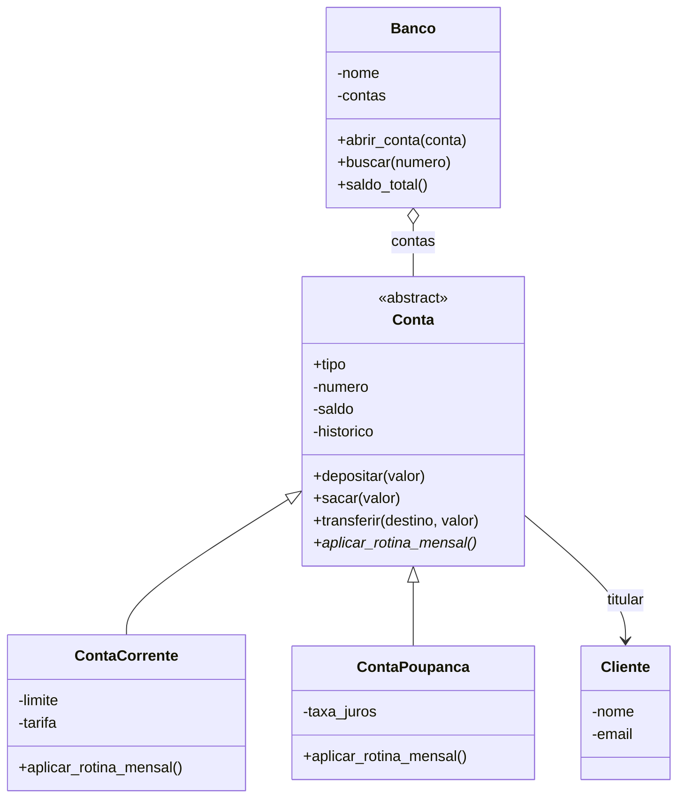

# Sistema Bancário em POO

Pequeno sistema de contas bancárias feito para praticar classes, encapsulamento, herança, polimorfismo e classes abstratas.

## Como rodar

```
python main.py
```

Não precisa instalar nada além do Python 3. O `main.py` cria 12 objetos (5 clientes, 6 contas e 1 banco), roda a rotina mensal de todas as contas, faz uma transferência, compara objetos e testa entradas inválidas.

## Diagrama de classes



## Decisões de modelagem

**Herança (é um).** Uma conta corrente é uma conta, e uma poupança também. As duas compartilham número, titular, saldo, histórico, depósito, saque e transferência, então isso fica na classe `Conta` e as filhas só acrescentam o que é delas (limite e tarifa na corrente, taxa de juros na poupança). Os construtores das filhas chamam `super().__init__()` para reaproveitar a validação da mãe.

**Classe abstrata.** `Conta` herda de `ABC` e tem o método abstrato `aplicar_rotina_mensal()`. Não faz sentido existir uma "conta genérica", e o método abstrato obriga toda conta nova a dizer o que acontece no fim do mês. Tentar fazer `Conta(cliente)` levanta `TypeError`.

**Composição (tem um).** Uma conta *tem um* titular, então `Conta` guarda um `Cliente` em vez de herdar dele. O `Banco` também *tem* contas. Cliente não é um tipo de conta, nem banco é um tipo de lista, então herança seria errado nos dois casos.

**Polimorfismo.** O `Banco` percorre as contas e chama `aplicar_rotina_mensal()` sem saber o tipo. A corrente cobra a tarifa e a poupança credita os juros, cada uma do seu jeito. Os métodos `__str__` das filhas também estendem o da mãe com `super().__str__()`.

**Sem listas como valor padrão.** O histórico de cada conta é criado dentro do `__init__`, então duas contas nunca compartilham a mesma lista.

## Validações com @property

| Classe | Atributo | Regra | Erro |
|---|---|---|---|
| `Cliente` | `nome` | pelo menos 2 caracteres (após `strip`) | `ValueError` |
| `Cliente` | `email` | precisa casar com o regex de e-mail | `ValueError` |
| `Conta` | `saldo` | não pode ficar abaixo do mínimo da conta (0 na poupança, `-limite` na corrente) | `SaldoInsuficienteError` |
| `Conta` | `titular`, `numero`, `historico` | só leitura, sem setter | `AttributeError` |
| `ContaCorrente` | `limite` | não negativo e não menor que o saldo devedor atual | `ValueError` |
| `ContaCorrente` | `tarifa` | não negativa | `ValueError` |
| `ContaPoupanca` | `taxa_juros` | entre 0 e 0,10 | `ValueError` |

Além disso, o `__init__` rejeita saldo inicial negativo e titular que não seja `Cliente`, e as operações rejeitam valores que não sejam números positivos. Como tudo passa pelos setters, não existe objeto em estado inválido.

O saldo mínimo é decidido pelo método `_saldo_minimo()`, que a corrente sobrescreve. Assim o `sacar()` da mãe funciona para os dois tipos sem precisar de `if` por tipo de conta.

## Métodos especiais

- `__str__`: texto amigável para o usuário, em todas as classes.
- `__repr__`: texto técnico, parecido com o código que criaria o objeto.
- `__eq__` e `__hash__`: dois clientes são iguais se o e-mail for o mesmo (sem diferenciar maiúsculas); duas contas são iguais se o número for o mesmo.
- `__lt__`: compara contas pelo saldo, o que permite usar `sorted(banco)`. Não usei `total_ordering` de propósito, porque a igualdade é pelo número e a ordem é pelo saldo, e misturar os dois daria resultados estranhos.
- `__len__` e `__iter__` no `Banco`, para usar `len(banco)` e `for conta in banco`.

## Exemplo de saída

```
Rotina mensal (polimorfismo):
  Conta 001 (Corrente): -15.00
  Conta 002 (Poupança): +25.00
  Conta 003 (Corrente): -15.00
  ...

Entradas inválidas:
  e-mail sem @: ValueError - E-mail inválido: 'sem-arroba'.
  saque acima do limite: SaldoInsuficienteError - Saldo de R$ -4015.00 ficaria abaixo do mínimo de R$ -500.00.
  instanciar classe abstrata: TypeError - Can't instantiate abstract class Conta ...
```
